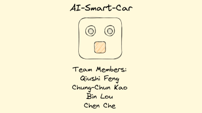
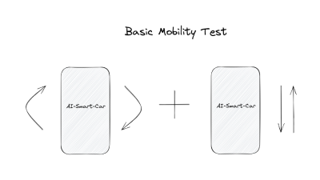
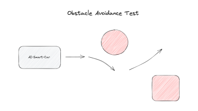
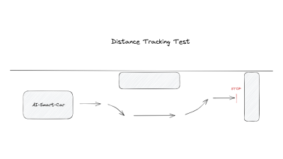
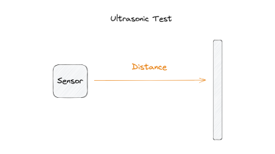
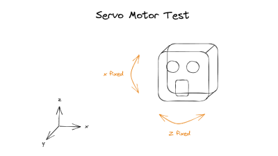
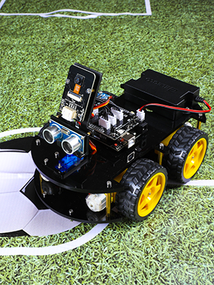

# AI-Smart-Car

## social media
 

**Please click on the logo to enter**

 

## 1. Project Description
Our theme is smart cars, which use C++as the main programming language to write driver and logic control programs, enabling cars to judge their environment based on data collected by sensors, and make expected behaviors based on algorithms to avoid danger and other behaviors. It has high practical value and potential in real life.

## 2. Functions
- Basic movements (forward, backward, turnning)
- Obstacle detection and avoidance
- Obstacle scanning (ultrasonic and servo motor)
- Navigation extraction
- Buzzer reminder

## 3. Experiments and Testing
#### 3.1. Basic movements

Use the testing program to move the car forward, backward, and rotate it 90 degrees left and right respectively.

#### 3.2. Obstacle avoidance

Place the car on the designated route, place some obstacles along the route, and control the car to travel along the route. It can be observed that the car scans the objects in front of it through a servo motor driven ultrasonic sensor while driving, and avoids obstacles during the process, allowing the car to travel safely.

#### 3.3. Distance tracking

During the driving process of the vehicle, the sensor will first sense the distance between one side of the wall and maintain it within the set distance. When there is a lane intrusion obstacle, the car can avoid it and still maintain the distance. When the obstacle disappears, the car will also remain the same as before. At the same time, when an unavoidable obstacle appears in front of the car, the car will stop.

#### 3.4. Ultrasonic sensor

Ultrasonic sensors can measure the distance between objects in front and vehicles. In the experimental video, we can measure the precise distance by placing our hand in front of the sensor.

#### 3.5. Servo motors

In our smart car, the ultrasonic sensor is dynamically controlled by two servo motors. Once we create a coordinate system for the vehicle, we can better write motor drive strategies. The two motors rotate along the z-axis and x-axis respectively, allowing the ultrasonic sensor to scan objects in front of the vehicle.

#### 3.6. Buzzer reminder
We set a 3-second test buzzer reminder

## 4. value in reality
With the development of automobiles in the field of intelligence, drivers' operations have become increasingly simple, and various autonomous driving functions have provided convenience for people's lives. In the future, cars will no longer even need the steering wheel, accelerator, and brakes. 
 
The function we developed is also based on the above concept. Through Google Maps, we can drive the car from point a to point b. If the accuracy of the map is high enough, theoretically it can achieve level 5 autonomous driving in cities. On the other hand, for some special road conditions, such as pedestrian crossings, roadblocks, and some unexpected situations, our developed ultrasonic ranging function can also monitor obstacles in front of the vehicle in real-time, allowing the car to slow down or avoid them in advance. 
 
In addition, we also considered the situation of lane intrusion. When vehicles or obstacles invade the driving lane, our developed function can avoid or stop based on the proportion of obstacles occupied. This function can be applied to some special vehicles, such as road cleaning vehicles.

## 5. Hardware

1. 1 x Raspberry Pi 1B
2. 1 x 18650 batteries
3. 4 x Driven Wheel
4. 4 x DC Speed Reduction Motor
5. 4 x Motor Bracket Package
6. 1 x Connection Board
7. 1 x Jumper Wire F/F(4)
8. 1 x XH-2.54-5Pin Cable
9. 1 x Ultrasonic Module

## 6. software
1. C++11 Standard Template Library
2. PCA9685
3. OpenCV
4. Raspberry Pi OS

## 7. project contributors
| NAME | GUID |
| :----: | :----: |
| Qiushi Feng | 2785563F |
| Chung-Chun Kao | 2721714K |
| Bin Lou | 2785471L |
| Chen Che | 2729749C |

 
**Real-Time Embedded Programming Course Work**