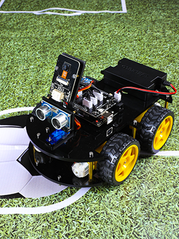

# AI-Smart-Car

## Introduction

A Raspberry Pi car with basic functions (move, automatic obstacle avoidance.. etc) as well as a system which automatically navigates based on Google Maps. 

## Specification

1 x Raspberry Pi 4B  
1 x 18650 batteries  
4 x Driven Wheel  
4 x DC Speed Reduction Motor  
4 x Motor Bracket Package  
1 x Connection Board  
1 x Jumper Wire F/F(4)  
1 x XH-2.54-5Pin Cable  
1 x Ultrasonic Module  
1 x Camera Module (OV2640) 

## Features

+ Basic movement (go straight, head back, turn left or right)
+ Obstacle Avoidance
+ Automatic follow
+ Line tracking
+ Traffic lights recognition
+ Navigation extraction and processing
+ To-do

## Source

### Drive part
To-do

### Obstacle_avoidance part
To-do

### Navigation_extraction part
To-do

## Contributor
* Qiushi Feng
* Chung-Chun Kao
* Bin Lou
* Chen Che

<u>Real Time Embedded Programming Course Work</u>
